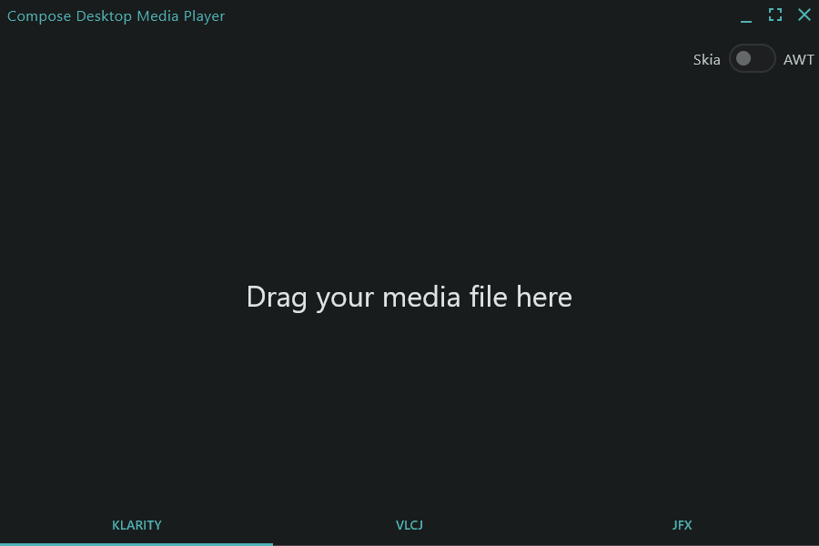

<h1 align="center">🎥 Compose Desktop Media Player (CDMP)</h1>

<p align="center">
  <strong>A high-performance, multi-backend audio and video player for Jetpack Compose Desktop.</strong><br>
  Seamlessly integrate media playback into your KMP desktop applications using native Skia rendering and deterministic state management.
</p>

<p align="center">
  
  
  
  
</p>

<div align="center">
  
</div>

---

## ✨ Key Features

* **Native Skia Rendering:** Bypasses legacy Swing platform constraints. Renders video directly onto a KMP Skia Canvas
  for zero-copy overhead and maximum frame rates.
* **Hot-Swappable Engines:** Switch between **Klarity**, **VLCJ**, and **JavaFX** on the fly without dropping the UI
  state.
* **Deterministic Architecture:** Built entirely on the [Reduce & Conquer](https://github.com/numq/reduce-and-conquer)
  pattern. Enjoy Elm and CQRS-inspired unidirectional data flow for rock-solid UI synchronization.
* **Out-of-the-Box UI Controls:** Includes a fully functional frameless window decoration (`WindowDecoration`),
  draggable overlay controls, playback speed toggles, and volume management.
* **Hardware & Performance Profiling:** Built-in `SystemPerformanceMonitor` to track CPU and heap/native memory
  allocation in real-time.
* **Drag-and-Drop Ready:** Integrated `DragAndDropTarget` for seamless local file loading.

---

## 🏗️ Playback Backends

CDMP provides an abstraction layer over three powerful media engines, allowing you to choose the best fit for your
specific desktop target:

### 1. [Klarity](https://github.com/numq/Klarity) (Recommended)

A custom-built FFmpeg multimedia player designed explicitly for Jetpack Compose. Written in C++ and Kotlin, it decodes
media via JNI and pushes frames directly to the Skia backend. Provides the most native, performant experience.

### 2. VLCJ

Proven JVM bindings for the robust VLC media player. CDMP supports both KMP Skia buffer rendering
(`BufferFormatCallback`) and AWT `SwingPanel` fallbacks.

### 3. JavaFX MediaPlayer

Leverages the official media player from the JavaFX framework, wrapped seamlessly into the Compose tree using KMP
interop.

---

## 🧠 Architecture Overview

The core of CDMP relies on a strict Reducer-based architecture. Every user interaction and media callback is dispatched
as a discrete `Command` or `Event`, processed by domain-specific reducers (e.g., `NavigationReducer`,
`PreviewPlaybackReducer`).

```kotlin
// Example: Predictable Unidirectional Data Flow
data class PlaybackState(
    val playbackBackend: PlaybackBackend,
    val renderBackend: RenderBackend,
    val playerStatus: PlayerStatus = PlayerStatus.Empty,
    val playbackSpeedFactor: Float = 1f,
    val volume: Float = 1f,
    val isMuted: Boolean = false,
)
```

---

## License

MIT - see [LICENSE](LICENSE) file for details.

---

<p align="center">
  <a href="https://numq.github.io/support">
    
  </a>
  <br>
  <a href="https://numq.github.io/support" style="text-decoration: none;">
    <code><font color="#bb9af7">Support Development: numq.github.io/support</font></code>
  </a>
</p>